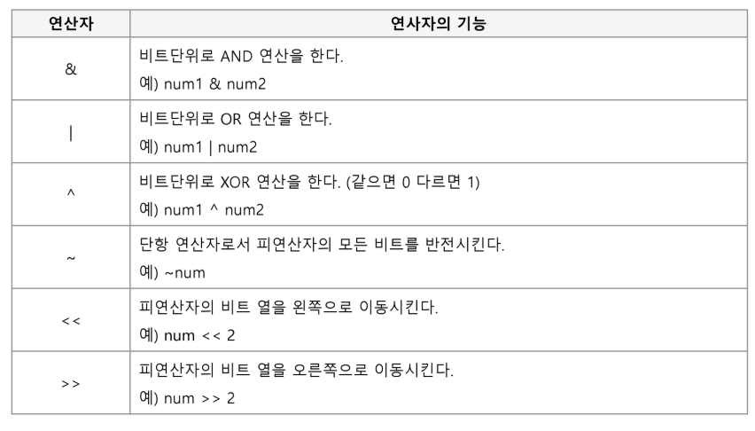
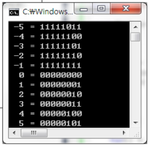
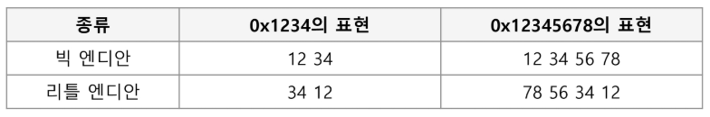
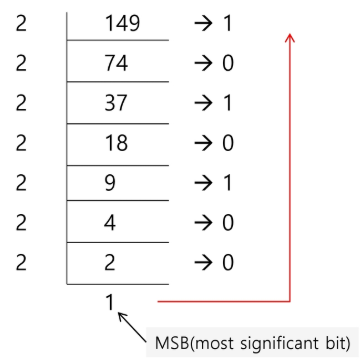
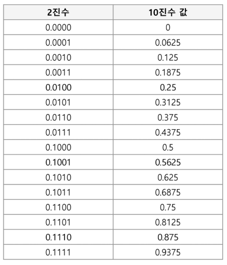
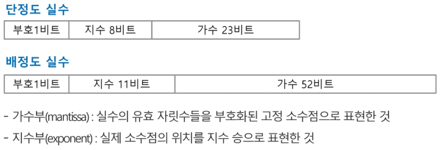
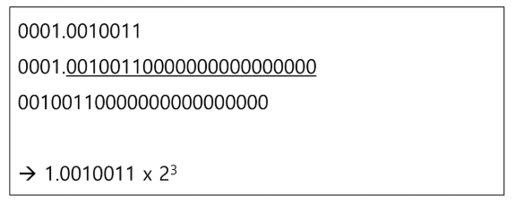
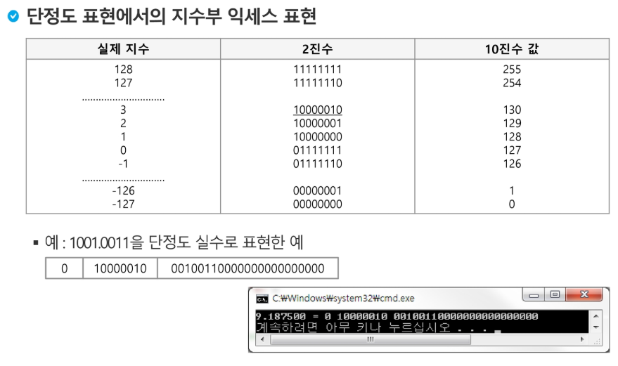

# 1. Start
최적화 문제 => 효율적인 문제 해결 방법을 찾는다

* 알고리즘 설계 기법
  - 완전 탐색
  - 백트래킹
  - 동적 계획법
  - 분할 정복
  - 탐욕
  - 자료 구조들

## SW  문제 해결

* 코딩 교육 이슈

  전세계적으로 관심이 많다

* 브루스 에켈 - 프로그래밍...잘하는 사람과 못하는 사람의 생산성 차이가 스무 배

* SW 문제 해결 역량이란?

  * 프로그램을 하기 위한 많은 제약 조건과 요구 사항을 이해하고 최선의 방법을 찾아내는 능력
  * 추상적인 기술

* 문제 해결 능력 훈련을 위해서?

  * 일부 새로운 언어, 프레임워크, 개발 방법론만을 배워나가는 것만으로 충분하지 않다. 이들을 조합해 나가는 방법을 배워야 하지만 쉽지 않다.


## 복잡도 분석

* Big O 표기법


## 표준 입출력 방법

* 입력

  ```python
  import sys; sys.stdin = open('input.txt', 'r')
  ```

* 출력

  ```python
  print(a)
  ```

  


## 비트 연산

* 비트 연산자

  

* 1 << n

  * 2^n의 값을 갖는다.
  * 원소가 n개일 경우의 모든 부분집합의 수를 의미한다.
  * Power set(모든 부분 집합)
    * 공집합과 자기 자신을 포함한 모든 부분 집합
    * 각 원소가 포함되거나 포함되지 않는 2가지 경우의 수를 계산하면 모든 부분집합의 수가 계산된다.

* i & (1 << j)

  * 계산 결과는 i의 j번째 비트가 1인지 아닌지를 의미한다.

* 비트 연산 예제1

  ```python
  def Bbit_print(i):
      output = ''
      for j in range(7, -1, -1):
          output += '1' if i & (1 << j) else '0'
      print(output)
      
  for i in range(-5, 6):
      print('%3d = ' % i, end='')
      Bbit_print(i)
  ```

  

  음수를 보수 형태로 저장


* 비트 연산 예제2

  ```python
  def Bbit_print(i):
      output = ''
      for j in range(7, -1, -1):
          output += '1' if i & (1<<j) else '0'
      print(output, end='')
  a = 0x10
  x = 0x01020304
  # => 00000001(01) 00000010(02) 00000011(03) 00000100(04)
  print('%d = ' % a, end='')
  Bbit_print(a)
  print()
  print('0%X= '%x, end='')
  for i in range(0, 4):
      Bbit_print((x>>i*8) & 0xff) # 최하위 8비트씩 끊어서 실행
  ```

* 엔디안(Endianness)

  * 컴퓨터의 메모리와 같은 1차원의 공간에 여러 개의 연속된 대상을 배열하는 방법을 의미하며 HW 아키텍처마다 다르다.

  * 주의 : 속도 향상을 위해 바이트 단위와 워드 단위를 변환하여 연산 할 때 올바로 이해하지 않으면 오류를 발생 시킬 수 있다.

  * 엔디안은 크게 두 가지로 나뉨

    * 빅 엔디안(Big-Endian)

      보통 큰 단위가 앞에 나옴. 네트워크

    * 리틀 엔디안(Little-Endian)

      작은 단위가 앞에 나옴. 대다수 데스크탑 컴퓨터

    


* 비트 연산 예제3

  * 엔디안 확인 코드

    ```python
    n = 0x00111111
    
    if n & 0xff:
        print('little endian')
    else:
        print('big endian')
    ```

* 비트 연산 예제4

  * 엔디안 변환 코드

    ```python
    def ce(n): # change endian
        p = []
        for i in range(0, 4):
            p.append((n >> (24 - i*8)) & 0xff)
        return p
    ```

    ```python
    def ce1(n):
        return (n << 24 & 0xff000000) | (n << 8 & 0xff0000) | (n >> 8 0xff00) | (n >> 24 & 0xff)
    ```

    ```python
    x = 0x01020304
    p = []
    for i in range(0, 4):
        p.append((x >> (i*8)) & 0xff)
    print('x = %d%d%d%d' & (p[0], p[1], p[2], p[3]))
    p = ce(x)
    print('x = %d%d%d%d' & (p[0], p[1], p[2], p[3]))
    ```

* 비트 연산 예제5

  * 비트 연산자 ^를 두번 연산하면 처음 값을 반환한다.

    ```python
    def Bbit_print(i):
        output = ''
        for j in range(7, -1, -1):
            output += '1' if i & (1<<j) else '0'
        print(output)
    a = 0x86
    key = 0xAA
    
    print('a ==>', end='')
    Bbit_print(a)
    
    print('a^=key ==>', end='')
    a ^= key
    Bbit_print(a)
    
    print('a^=key ==>', end='')
    a ^= key
    Bbit_print(a)
    ```

    


## 진수

* 2진수, 8진수, 10진수, 16진수

* 10진수 => 타 진수로 변환

  * 원하는 타진법의 수로 나눈 뒤 나머지를 거꾸로 읽는다.

  * (예제) (149)10 = (10010101)2 = (225)8 = (95)16

    

* 타 진수 => 10진수로 변환

  * 예) (135)8 = 1 x 8^2 + 3 x 8^1 + 5 x 8^0 = 93(10)

* 코드 예시

  ```python
  arr = [1, 3, 5]	# 135(8진수)
  val = 0
  for d in arr:
      val = val * 8 + d
  print(val)	# 93(10진수)
  ```

* 컴퓨터에서의 음의 정수 표현 방법

  * 1의 보수 : 부호와 절대값으로 표현된 값을 부호 비트를 제외한 나머지 비트들을 0은 1로, 1은 0으로 변환한다.
    * -6 : 1000 0000 0000 0110 : 부호와 절대값 표현
    * -6 : 1111 1111 1111 1001 : 1의 보수 표현
  * 2의 보수: 1의 보수 방법으로 표현된 값의 최하위 비트에 1을 더한다.
    * -6 : 1111 1111 1111 1010 : 2의 보수 표현

  


## 실수

* 실수의 표현

  * 소수점 이하 4자리를 10진수로 나타내보면

    

  * 컴퓨터는 실수를 표현하기 위해 부동 소수점(floating-point) 표기법을 사용한다.

  * 부동 소수점 표기 방법은 소수점의 위치를 고정시켜 표현하는 방식이다.

    * 소수점의 위치를 왼쪽의 가장 유효한 숫자 다음으로 고정시키고 밑수의 지수승으로 표현

      

* 실수를 저장하기 위한 형식

  * 단정도 실수(32비트)
  * 배정도 실수(64비트)

  

* 단정도 실수의 가수 부분을 만드는 방법

  * 예: 1001.0011

    * 정수부의 첫 번째 자리가 1이 되도록 오른쪽으로 시프트

    * 소수점 이하를 23비트로 만든다

    * 소수점 이하만을 가수 부분에 저장

    * 지수 부분은 시프트 한 자릿수 만큼 증가 또는 감소

      

* 단정도 실수의 지수 부분을 만드는 방법

  * 지수부에는 8비트가 배정(256개의 상태를 나타낼 수 있음)
  * 숫자로는 0-255까지 나타낼 수 있지만, 음수 값을 나타낼 수 있어야 하므로 엑세스(excess) 표현법을 사용
    * 엑세스 표현법: 지수부의 값을 반으로 나누어 그 값을 0으로 간주하여 음수지수와 양수지수를 표현하는 방법

* 단정도 표현에서의 지수부 엑세스 표현

  

* 컴퓨터는 실수를 근사적으로 표현한다.


# 2. 완전 검색 & 그리디

# 3. 분할 정복 & 백트래킹

## 순열/조합 생성

## DP

## 퀵 정렬

# 4. 그래프

## 최단 경로

## 최소신장트리

# 5. 문자열

## 접미어 트리, 접미어 배열

## 허프만 트리

# 6. DP1

# 7. DP2

# 8. 근사해, 경우의 수, 확률, 정수론