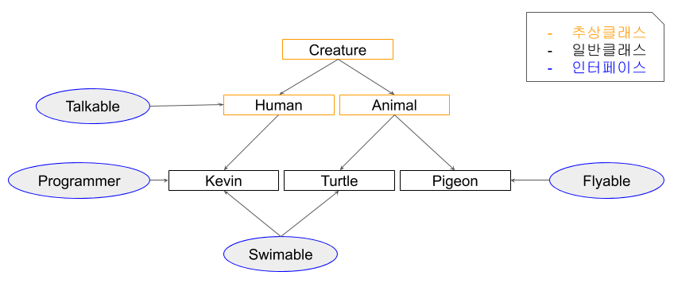

# 추상 클래스 vs 인터페이스

[참고링크](https://myjamong.tistory.com/150)


* 추상클래스
  * 상속 관계를 쭉 타고 올라갔을때 같은 조상클래스를 상속하는데 기능까지 완벽히 똑같은 경우
  * attack, printInfo
* 인터페이스
  * 상속 관계를 쭉 타고 올라갔을때 다른 조상클래스를 상속하는데 같은 기능이 필요할 경우 인터페이스 사용
  * Swimable
* 그림 예시



* 추상 클래스-Creature

```java
public abstract class Creature {
    private int x;
    private int y;
    private int age;
    
    public Creature(int x, int y, int age) {
        this.age = age;
        this.x = x;
        this.y = y;
    }
    
    public void age() {
        age++;
    }
    
    public void move(int xDistance) {
        x += xDistance;
    }
    
    public int getX() {
        return x;
    }
    public void setX(int x) {
        this.x = x;
    }
    public int getY() {
        return y;
    }
    public void setY(int y) {
        this.y = y;
    }
    
    public abstract void attack();
    public abstract void printInfo();
    
    @Override
    public String toString() {
        return "x : " + x + ", y : " + y + ", age : " + age;
    }
}
```

* 인터페이스-Talkable

```java
public interface Talkable {
    abstract void talk();
}
```

* Animal 클래스

```java
public abstract class Animal extends Creature{
    
    public Animal(int x, int y, int age) {
        super(x, y, age);
    }
    
    @Override
    public void attack() {
        System.out.println("몸을 사용하여 공격!!");
    }
}
```

printInfo는 한번 더 상속하여 하위 클래스에서 사용을 위해 남겨둠

* Pigeon 클래스

```java
public class Pigeon extends Animal implements Flyable{
    public Pigeon(int x, int y, int age) {
        super(x, y, age);
    }
    
    @Override
    public void fly(int yDistance) {
        setY(getY() + yDistance);
    }
    
    @Override
    public void flyMove(int xDistance, int yDistance) {
        setY(getY() + yDistance);
        setX(getX() + xDistance);
    }
    
    @Override
    public void printInfo() {
        System.out.println("Pigeon -> " + toString());
    }
}

```

