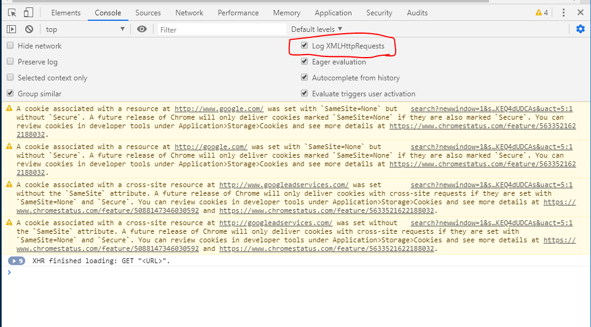
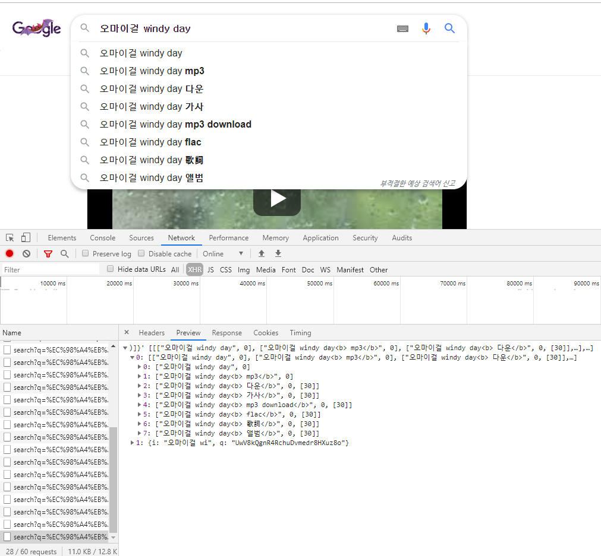

# Todo

## todo 목록 추가

* 기본 html

  ```html
  <!DOCTYPE html>
  <html lang="ko">
  
  <head>
    <meta charset="UTF-8">
    <meta name="viewport" content="width=device-width, initial-scale=1.0">
    <meta http-equiv="X-UA-Compatible" content="ie=edge">
    <title>Document</title>
  </head>
  
  <body>
    <h1>Todo List</h1>
    <label for="input">할 일을 입력하세요</label>
    <input type="text" id="input">
    <button id="input-button">+</button>
    <ul id="todo-list">
      <li> +버튼이 눌리면 리스트에 추가되도록 구현하세요.</li>
    </ul>
  
    <script>
      // 여기를 채워야함
    </script>
  </body>
  
  </html>
  ```

  ```html
  <script>
      // 변수들 선언
  	const form = document.querySelector('form')
      const button = document.querySelector('#input-button')
      const input = document.querySelector("#input")
      const todos = document.querySelector('#todo-list')
      
      form.addEventListener('submit', function (event) {
        // event가 새로고침되어서 전송되는 것을 막음
        event.preventDefault()
  
        // event log가 발생했을때
        // event.target에 event가 발생한 대상의 정보가 들어있음
        // this는 event.target, arrow function을 쓰면 this는 window를 가리팀. 사용자제
        // 위에 있는 input과 scope가 다르기 때문에 const 해도 문제가 없다
        // const input = event.target.previousElementSibling
  
        if (input.value) {
          const li = document.createElement('li')
          const deleteButton = document.createElement('button')
          deleteButton.innerText = "삭제"
          deleteButton.addEventListener('click', function (event) {
            li.remove()
          })
          li.innerText = input.value
          li.appendChild(deleteButton)
          input.value = ''
          todos.appendChild(li)
        } else {
          alert('내용을 입력하세요')
        }
      })
  </script>
  ```
  
  


## 11_blocking

* 이벤트 루프 : call stack, callback queue 확인

  * [callback 확인]( http://latentflip.com/loupe/ )

  * call stack이 비어있으면, callback queue에서 call stack으로 이동

  * tick(틱)
  
  * 거의 javascript 시험에 무조건 나옴
  
    ```js
    function a() {
        console.log('a')
    }
  console.log('hi')   // 1.
    setTimeout(a, 3000) // 3.	call stack
  console.log('bye')  // 2.
    ```

    ```js
    function printHello() {
        console.log('Hellooo')	// 3초 있다가 실행됨
    }
    
    function baz() {
        console.log('baz')  // 1
        setTimeout(printHello, 3000)    // 3, 비동기로 동작하는 함수
        console.log('baz end')  // 2
    }
    
    function bar() {
        baz()	// baz 실행
    }
    
    function foo() {
        bar()	// bar 실행
    }
    
    foo()	// foo 실행
    ```


* 자바 스크립트의 동작

  * [자바스크립트는 어떻게 작동?]( [https://engineering.huiseoul.com/%EC%9E%90%EB%B0%94%EC%8A%A4%ED%81%AC%EB%A6%BD%ED%8A%B8%EB%8A%94-%EC%96%B4%EB%96%BB%EA%B2%8C-%EC%9E%91%EB%8F%99%ED%95%98%EB%8A%94%EA%B0%80-%EC%97%94%EC%A7%84-%EB%9F%B0%ED%83%80%EC%9E%84-%EC%BD%9C%EC%8A%A4%ED%83%9D-%EA%B0%9C%EA%B4%80-ea47917c8442](https://engineering.huiseoul.com/자바스크립트는-어떻게-작동하는가-엔진-런타임-콜스택-개관-ea47917c8442) )
  
* [Axios]( https://github.com/axios/axios )
  
  * js에서 인기 많은 라이브러리 중 하나
    
  * http 요청을 위한 라이브러리
  
  * xml을 http로 요청(json이 나오기 전에 xml로 데이터를 주고 받음)
	
    
  	
  	항상 체크하기
  		
  
* 자동완성
  
   
    	
   Network - XHR 살펴보기
    	
  
* 네트워크 성능
  
  Performance - 설정 - Network 에서 설정 가능
  
* synchronous/Asynchronous

   * [참고 문서]( https://victorydntmd.tistory.com/8 )

   * 동기(synchronous) 
     * 요청과 그 결과가 동시에 일어난다는 뜻 
     *  어떤 객체 또는 함수 내부에서 다른 함수를 호출했을 때 이 **함수의 결과를 호출한 쪽에서 처리**하면 동기 
   * 비동기(Asynchronous) -  요청과 그 결과가 동시에 일어나지 않는다는 뜻
     *  요청과 그 결과가 동시에 일어나지 않는다는 뜻 
     *  동기와 달리 어떤 객체 또는 함수 내부에서 다른 함수를 호출했을 때 이 **함수의 결과를 호출한 쪽에서 처리하지 않으면 비동기**
     * 파이썬에서 비동기 가능

* blocking/ non-blocking

   * 블로킹(blocking)
     * 자신의 수행결과가 끝날 때까지 제어권을 갖고 있는 것을 의미
   * 논블로킹(non-blocking)
     * 자신이 호출되었을 때 제어권을 바로 자신을 호출한 쪽으로 넘기며,  자신을 호출한 쪽에서 다른 일을 할 수 있도록 하는 것을 의미


## Axios 실습

[jsonplaceholder 사이트]( https://jsonplaceholder.typicode.com/ )

* 브라우저(프론트 엔드)를 통해 요청을 보내서 브라우저에 있는 데이터를 가져오는 작업


## dog & cat

[dog]( https://dog.ceo/dog-api/ )


## unsplash

[random bg]( https://source.unsplash.com/ )

