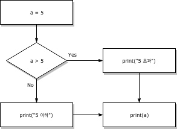
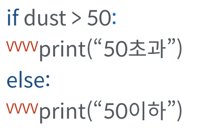
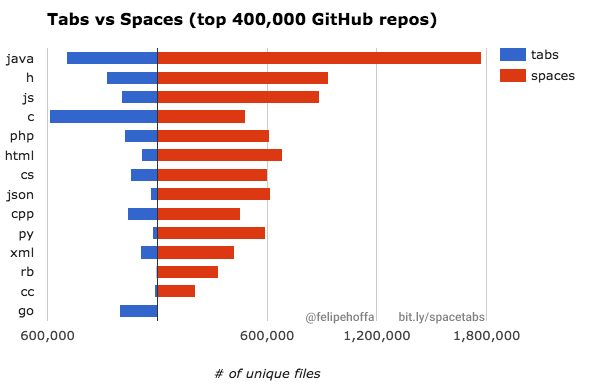
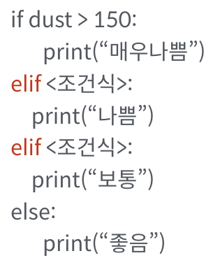
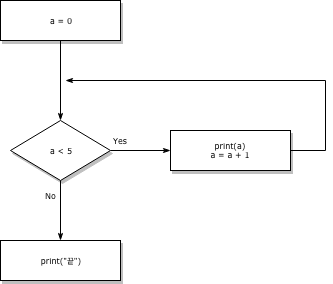
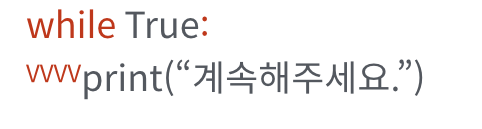
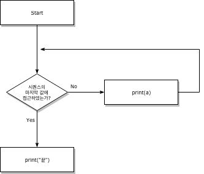
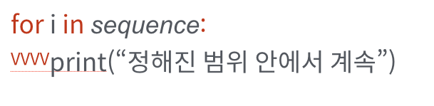
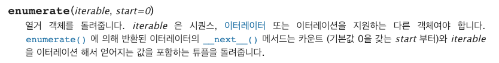

# 제어문

지금까지의 코드는 위에서부터 아래로 순차적으로 명령을 수행하는 프로그램을 작성하였다. 

제어문(Control of Flow)은 크게 반복문과 조건문으로 나눌 수 있고, 이는 순서도(Flow chart로 표현이 가능하다.)


<center> 
    
</center>


```python
# 위의 flow chart를 조건문을 통해 만들어봅시다.
a = 5
if a > 5:
    print('5 초과')
else:
    print('5 이하')
print(a)
```

    5 이하
    5
    

## 조건문

1. `if` 문은 반드시 일정한 참/거짓을 판단할 수 있는 `조건식`과 함께 사용이 되어야한다.
`if <조건식>:`

2-1. `<조건식>`이 참인 경우 `:` 이후의 문장을 수행한다.

2-2. `<조건식>`이 거짓인 경우 `else:` 이후의 문장을 수행한다.

* 이때 반드시 **들여쓰기를** 유의해야한다. 
파이썬에서는 코드 블록을 자바나 C언어의 `{}`와 달리 `들여쓰기`로 판단하기 때문이다.
* 앞으로 우리는 `PEP-8`에서 권장하는 `4spaces`를 사용할 것이다.


<center>
    
</center>

<center><strong style="font-size: 40px;">우리는 4spaces를 맞춰서 씁니다!</strong></center>
<br>

<center>
    
</center>    


[출처 : 400,000 GitHub repositories, 1 billion files, 14 terabytes of code: Spaces or Tabs?](https://medium.com/@hoffa/400-000-github-repositories-1-billion-files-14-terabytes-of-code-spaces-or-tabs-7cfe0b5dd7fd)


### 조건문 연습
> 조건문을 통해 사용자가 입력한 날짜가 크리스마스인지 확인하세요.

---

```
예시 출력)
12/25
크리스마스입니다.
```


```python
# 실습!
is_christmas = input("날짜를 입력해주세요 ex)12/24 : ")
# 여기에 코드를 작성하세요.
if is_christmas == '12/24':
    print('크리스마스입니다.')
else:
    print('크리스마스가 아닙니다')
```

    날짜를 입력해주세요 ex)12/24 : 12/24
    크리스마스입니다.
    


```python
month, day = map(int, is_christmas.split('/'))
print(month, day)
if month not in range(1, 13) or day not in range(1, 32):
    print('날짜 형식이 올바르지 않습니다')
```

    12 24
    

### 조건문 활용


> **조건문을 통해 변수 num의 값과 홀수/짝수 여부를 출력하세요.**

---

```
예시 출력)
3
홀수입니다.
```


```python
# 실습!
num = int(input("숫자를 입력하세요 : "))
# 여기에 코드를 작성하세요.
if num % 2:
    print(num)
    print('홀수입니다')
else:
    print(num)
    print('짝수입니다')
```

    숫자를 입력하세요 : 3
    3
    홀수입니다
    

## 복수 조건문

2개 이상의 조건문을 활용할 경우 `elif <조건식>:`을 활용한다.
<center>

</center>

### 복수조건문 활용

> 조건문을 통해 변수 score에 따른 평점을 출력하세요.

|점수|등급|
|---|---|
|90점 이상|A|
|80점 이상|B|
|70점 이상|C|
|60점 이상|D|
|60점 미만|F|

--- 

```
예시 출력)
B
```


```python
# 실습!
score = int(input("점수를 입력하세요 : "))
# 여기에 코드를 작성하세요.
if score >= 90:
    print('A')
elif score >= 80:
    print('B')
elif score >= 70:
    print('C')
elif score >= 60:
    print('D')
else:
    print('F')
```

    점수를 입력하세요 : 85
    B
    

### 중첩조건문 활용

> **위의 실습문제 2코드를 활용하여 
95점 이상이면, "참잘했어요"를 함께 출력해주세요**

--- 

```
예시 출력)
A
참잘했어요
```


```python
# 실습!
score = 96
# 여기에 코드를 작성하세요.
if score >= 90:
    if score >= 95:
        print('A')
        print('참잘했어요')
    else:
        print('A')
elif score >= 80:
    print('B')
elif score >= 70:
    print('C')
elif score >= 60:
    print('D')
else:
    print('F')
```

    A
    참잘했어요
    

## 조건 표현식(Conditional Expression)


```
true_value if <조건식> else false_value
```
    
와 같이 표현식을 작성할 수 있다. 이는 보통 다른 언어에서 활용되는 삼항연산자와 동일하다.


```python
# 조건 표현식을 사용해봅시다.
a = int(input("숫자를 입력하세요 : "))
# 여기에 코드를 작성하세요.
print('0보다 큼') if a > 0 else print('0보자 작거나 같음')
```

    숫자를 입력하세요 : 3
    0보다 큼
    

* 표현식은 보통 조건에 따라 값을 정할 때 많이 활용된다.
*  아래의 코드는 무엇을 위한 코드일까요?
```python
num = int(input("숫자를 입력하세요 : "))
value = num if num >= 0 else 0
print(value)
```


```python
num = int(input("숫자를 입력하세요 : "))
value = num if num >= 0 else 0
print(value)
```

    숫자를 입력하세요 : -1
    0
    

### 조건표현식과 동일한 `if`문 작성하기

> 다음의 코드와 동일한 `if`문을 작성해보세요.

```python
num = -5
value = num if num >= 0 else 0
print(value)
```
---

```
예시 출력)
0
```


```python
# 여기에 코드를 작성하세요.
num = -5
if num >= 0:
    value = num
else:
    value = 0
print(value)
```

    0
    

### 조건표현식 만들어보기

> 다음의 코드와 동일한 조건 표현식을 작성해보세요.

```python
num = 2
if num % 2 == 1:
    result = '홀수입니다.'
else:
    result = '짝수입니다.'
print(result)
```
---
```
예시 출력)
짝수입니다.
```


```python
# 여기에 코드를 작성하세요.
num = 2
result = '홀수입니다' if num % 2 else '짝수입니다'
print(result)
```

    짝수입니다
    

# 반복문

## `while` 문

`while`문은 조건식이 참(True)인 경우 반복적으로 코드를 실행합니다. 
<br>
<br>
<center> 
    
</center>

**while 문은 종료조건을 반드시 설정해주어야 합니다.**


```python
# 위의 flow chart를 조건문을 통해 만들어봅시다.
a = 0
while a < 5:
    print(a)
    a += 1
print('끝')
```

    0
    1
    2
    3
    4
    끝
    

<center>
    
</center>

`while`문 역시 `<조건식>`이후에 `:`이 반드시 필요하며, 

이후 오는 코드 블록은 `4spaces`로 **들여쓰기**를 해주셔야 합니다.

### `while`문 작성하기
> 사용자가 "안녕"이라고 입력할때까지 인사하는 코드를 작성해보세요.


```python
# 여기에 코드를 작성하세요.
word = ''
while word != '안녕':
    word = input('메시지를 작성하세요 : ')
```

    메시지를 작성하세요 : ㅁㄹㅇㄴ
    메시지를 작성하세요 : ㅋㅌㅊㅍ
    메시지를 작성하세요 : ㅂㅈㄷ
    메시지를 작성하세요 : ㄱ
    메시지를 작성하세요 : ㄴㅇㄹ
    메시지를 작성하세요 : 안녕
    

## `for` 문

`for`문은 정해진 범위 내(시퀀스)에서 순차적으로 코드를 실행합니다.

<br>
<center>
    
</center>


```python
# flowchart를 for문을 통해 코드로 작성해봅시다.
my_list = [1, 2, 3]
for a in my_list:
    print(a)
print('끝')
```

    1
    2
    3
    끝
    

<center>
    
</center>

---
```
for variable in sequence:
    code line1
    code line2
```

`for`문은 `sequence`를 순차적으로 **variable**에 값을 바인딩하며, 코드 블록을 시행합니다.


### `for`문 연습
> for문을 활용하여 사용자가 입력한 문자를 한글자씩 출력해보세요.

---

```
예시 출력)
문자를 입력하세요 : 안녕!
안
녕
!
```


```python
a = input("문자를 입력하세요 : ")
# 여기에 코드를 작성하세요.
for char in a:
    print(char)
```

    문자를 입력하세요 : 안녕!
    안
    녕
    !
    

###  `for`문과 `if`문 작성하기

> 반복문과 조건문만 활용하여 1~30까지 숫자 중에 홀수만 담긴 리스트를 만드세요.

list에서 값 추가는 `.append(value)`로 합니다.

---
```
예시 출력)
[1, 3, 5, 7, 9, 11, 13, 15, 17, 19, 21, 23, 25, 27, 29]
```


```python
# 여기에 코드를 작성하세요.
# 결과통
holsu = []
# 어딘가에서 꺼내와서
for i in range(31):
    # 어떠한 조건에 맞으면
    if i % 2:
        # 넣는다.
        holsu.append(i)
print(holsu)
```

    [1, 3, 5, 7, 9, 11, 13, 15, 17, 19, 21, 23, 25, 27, 29]
    


```python
#### list comprehension
[i for i in range(31) if i % 2]
```


    [1, 3, 5, 7, 9, 11, 13, 15, 17, 19, 21, 23, 25, 27, 29]


### index와 함께 `for`문 활용

`enumerate()`를 활용하면, 추가적인 변수를 활용할 수 있습니다.


```python
# enumerate()를 활용해서 출력해봅시다.
lunch = ['짜장면', '초밥']

for idx, menu in enumerate(lunch):
    # idx, menu = (0, '짜장면')
    print(idx)
    print(menu)
```

    0
    짜장면
    1
    초밥
    

* `enumerate()`는 [파이썬 표준 라이브러리의 내장함수](https://docs.python.org/ko/3.6/library/functions.html) 중 하나이며, 다음과 같이 구성되어 있다.

<center>
    
</center>


```python
# enumerate() 함수를 사용하였을 때 어떻게 표현이 되는지 확인해봅시다.
list(enumerate(lunch))
```


    [(0, '짜장면'), (1, '초밥')]


```python
# 숫자를 1부터 카운트 할 수도 있습니다.
for idx, menu in enumerate(lunch, start=1):
    print(idx, menu)
```

    1 짜장면
    2 초밥
    

### dictionary 반복문 활용

기본적으로 dictionary를 `for`문을 시행시키면 다음과 같이 시행됩니다.


```python
# 옆자리 친구의 이름을 활용하여 dictionary를 만들어봅시다.
classroom = {'조선행' : '27', '최무연' : '28', '서현택': '27'}
for key in classroom:
    print(key)
    print(classroom[key])
```

    조선행
    27
    최무연
    28
    서현택
    27
    

dictionary의 `key`를 출력함으로써 `value`에도 접근할 수 있기 때문입니다.

따라서 dictionary의 value를 출력하기 위해서는 아래와 같이 작성합니다.


```python
# value를 출력해봅시다.
for key in classroom:
    print(classroom[key])
```

    27
    28
    27
    

* dictionary에서 `for` 활용하는 4가지 방법

```python
# 0. dictionary (key 반복)
for key in dict:
    print(key)

# 1. key 반복
for key in dict.keys():
    print(key)
    
# 2. value 반복    
for val in dict.values():
    print(val)

# 3. key와 value 반복
for key, val in dict.items():
    print(key, val)

```

### dictionary `for`문 작성하기

> 4가지 반복문을 활용해보고 출력되는 결과를 확인해보세요.

```
blood_type = {"A": 4, "B": 2, "AB": 3, "O":1}

```

- 0번 : 혈액형의 종류는 다음과 같습니다 =>  A B AB O
- 1번 : 혈액형의 종류는 다음과 같습니다 =>  A B AB O
- 2번 : 총인원은 10명입니다.
- 3번 : A형은 4명입니다. B형은 2명입니다.


```python
# 여기에 코드를 작성하세요.
blood_type = {"A": 4, "B": 2, "AB": 3, "O":1}
```


```python
# 1. key 출력
for key in blood_type.keys():
    print(key, end=' ')
```

    A B AB O 


```python
# 2. 총 인원 출력(value)
sum = 0
for key in blood_type:
    sum += blood_type[key]
print(f'총인원은 {sum}명입니다')
```

    총인원은 10명입니다
    


```python
# 3. 혈액형별 인원출력(key, value)
for key, value in blood_type.items():
    print(f'{key}형은 {value}명입니다.')
```

    A형은 4명입니다.
    B형은 2명입니다.
    AB형은 3명입니다.
    O형은 1명입니다.
    


```python
print(blood_type.items()) # list의 친구라 생각
```

    dict_items([('A', 4), ('B', 2), ('AB', 3), ('O', 1)])
    


```python
print(blood_type.keys())
```

    dict_keys(['A', 'B', 'AB', 'O'])
    

## `break`, `continue`, `else`

### `break`

`break`문은 반복문을 종료하는 표현입니다. 


```python
# break 문을 활용해봅시다.
for i in range(10):
    if i > 2:
        print('0 ,1, 2')
        break
    print(i)
```

    0
    1
    2
    0 ,1, 2
    

### `break` 작성하기

> 조건문과 반복문, break를 활용하여 리스트에서 쌀이 나왔을때 for문을 멈추는 코드를 작성하세요


```python
rice = ["보리", "보리", "보리", "쌀", "보리"]
```

---
```
예시 출력)
보리
보리
보리
쌀
잡았다!
```


```python
rice = ["보리", "보리", "보리", "쌀", "보리"]
# 여기에 코드를 작성하세요.
for rice_type in rice:
    print(rice_type)
    if rice_type == '쌀':
        print('잡았다!')
        break
```

    보리
    보리
    보리
    쌀
    잡았다!
    

### `continue` 

`continue`문은 continue 이후의 코드를 수행하지 않고 다음 요소를 선택해 반복을 계속 수행합니다.


```python
# contirue 문을 활용해봅시다.
for i in range(5):
    if i % 2:
        continue
    print('짝수다!')
```

    짝수다!
    짝수다!
    짝수다!
    

### `continue` 작성하기

> 나이가 입력된 리스트가 있을때,
> 조건문과 반복문, continue를 활용하여 20살 이상일때만 "성인입니다"라는 출력을 하는 코드를 작성하세요


```python
age = [10, 23, 8, 30, 25, 31]
```

---
```
예시 출력)
성인입니다.
성인입니다.
성인입니다.
성인입니다.
```


```python
# 여기에 코드를 작성하세요.
age = [10, 23, 8, 30, 25, 31]
for i in age:
    if i >= 20:
        print('성인입니다')
        continue
```

    성인입니다
    성인입니다
    성인입니다
    성인입니다
    

### `else`

`else`문은 끝까지 반복문을 시행한 이후에 실행됩니다.

(`break`를 통해 중간에 종료되지 않은 경우만 실행)


```python
# break가 안되는 상황을 만들어봅시다.
for i in range(5):
    if i > 100:
        break
else:
    print('break 안됨!!!!')
```

    break 안됨!!!!
    


```python
# break가 되는 상황을 만들어봅시다.
# else가 없다면  break가 있든 없든 print가 실행됨
is_break=False
for i in range(5):
    if i < 100:
        is_break =True
        break
if not is_break:
    print('break 안됨!!!!')
```


```python
# break가 되는 상황을 만들어봅시다.
# else가 없다면  break가 있든 없든 print가 실행됨
# 위와 같은 동생
for i in range(5):
    if i < 100:
        break
else:
    print('break 안됨!!!!')
```

### `else`문 작성하기

> 조건문과 반복문, break, else 를 통해서 아래의 코드와 동일한 코드를 작성하세요.
> 
> (3이 있을 경우 True를 print하고, 아닐 경우 False를 print 합니다.)


```python
numbers = [1, 5, 10]
print(3 in numbers)
```

---
```
예시 출력)
False
```


```python
numbers = [1, 5, 10]
# 여기에 코드를 작성하세요.
for number in numbers:
    if number == 3:
        print(True)
        break
else:
    print(False)
```

    False
    
