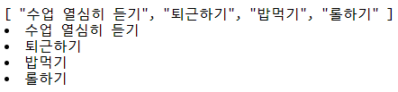

# Vue.js

[vue 사이트]( https://kr.vuejs.org/v2/guide/ )

* js - 명령형
* vue - 지시형

chrome extension에서 vue.js.develop 설치


## TODO

* v-for

  * 반복문 형태로 출력 가능하게 함

    ```html
    <div id="app">
      {{todos}}
      <li v-for="todo in todos">{{ todo }}</li>
    </div>
    ```
  
  

* v-if

  * 조건에 맞는 값만 출력

    ```html
    <li v-for="todo in todos" v-if="!todo.completed">
          {{ todo.content }}
        </li>
        <li v-else>
          [완료!]
        </li>
    ```

* v-on:click

  * 클릭하면 조건에 맞게 변경

    ```html
    <li v-for="todo in todos" v-if="!todo.completed" v-on:click="todo.completed=true">
        {{ todo.content }}
    </li>
    <li v-else>
        [완료!]
    </li>
    ```

* 클릭할때마다 완료, 미완료 상태 바꾸기

  ```html
  <li v-for="todo in todos" v-if="!todo.completed" v-on:click="toggleCompleted(todo)">
        {{ todo.content }}
      </li>
      <li v-else v-on:click="toggleCompleted(todo)">
        [완료!]
      </li>
  ```

  ```html
  methods: {
          toggleCompleted: function(todo) {
            todo.completed = !todo.completed
          }
        }
  ```

  

* 이미지 추가

  * 일반적인 것들을 제외하고는 디렉토리를 써서 출력한다

    ```html
    
    ```

    ```html
    data: {
            logo: "https://repository-images.githubusercontent.com/105165445/b8efdd00-5d13-11e9-902e-3ce3c3d7e548",
            todos: [
              {
    ```

### 이벤트 핸들링

[링크]( https://kr.vuejs.org/v2/guide/events.html )


## 강아지

* v-for, v-src 기억하기

  ```html
  <!DOCTYPE html>
  <html lang="en">
  <head>
    <meta charset="UTF-8">
    <meta name="viewport" content="width=device-width, initial-scale=1.0">
    <meta http-equiv="X-UA-Compatible" content="ie=edge">
    <title>Document</title>
    <script src="https://cdn.jsdelivr.net/npm/vue/dist/vue.js"></script>
    <script src="https://unpkg.com/axios/dist/axios.min.js"></script>
  </head>
  <body>
    <div id="app">
      
      <!-- 2-3. 반복문 -->
      <button v-on:click="getDog()">새로운 강아지 보기</button>
      <p>{{count}}</p>
    </div>
    <script>
      const app = new Vue({
        el: '#app',
        data: {
          images: [], // 2-1. 배열로 변경
          count: 0
        },
        methods:{
          getDog: function() {
            // 요청 보내서 가지고 오면,
            axios.get("https://dog.ceo/api/breeds/image/random")
            .then(response => {
            // imageUrl을 변경
              console.log(this) // arrow가 아니라면 this가 window여서 저장안됨
              this.images.push(response.data.message) // 2-2. 배열에 값넣기로 바꾸기
              this.count ++
            })
          }
        }
      })
    </script>
  </body>
  </html>
  ```

  


## 정리(vue_directive.html)

* vue 설치하고 시크릿 모드와 url 링크도 가능하게 설정

* 반복문과 조건문

  * 반복 => v-for
  * 조건 => v-if

* v-model

  * data에 있는 해당 model을 수정

  * v-model을 사용하려면 data 내에서 초기화 작업 필요

* v-bind

  ```html
  <!-- 속성값: v-bind
        v-bind 생략하는 방법으로도 작성 가능
      -->
      
      
  ```

  ```html
  <script>
      const app = new Vue({
        el: '#app',
        data: { // app.$data
        url: 'https://joshua1988.github.io/images/posts/web/vuejs/logo.png',
            ...
  ```

* v-on:click

  ```html
  <button v-on:click="countUp">+++++</button>
      <p>{{ counter }}</p>
      <button @click="countDown">------</button>
  ```

  ```html
  methods: {
          countUp: function() {
            this.counter ++
            console.log(this.counter)
          },
          countDown: function() {
            this.counter--
            console.log(this.counter)
          }
        }
  ```

  * 단축어로도 사용할 수 있다.(=@click)

* vue 문법 함수 - function 대신 괄호 사용
* class에 true, false 구별
* select를 통해서 할일, 완료 나누기

* data에 key 설정을 해줘야 중복 충돌 문제가 발생하지 않음
  
  * [Unix Time]( https://www.epochconverter.com/ )을 반환해서 id 부여


### computed

* todayByStatus를 methods에서 computed로 옮기기

* computed로 옮기면 함수에서 변수로 바뀌기 때문에 호출할 때 괄호를 빼고 호출함

  ```html
  <li v-for="todo in todosByStatus" 
          :class="{completed: todo.completed, true: true, false: false}"
          :key="todo.id">
  ```

* methods와 차이점

  * methods : 함수를 실행, 모든 data 변경시마다 계속 호출
  * computed: 함수의 실행 결과를 계산된(computed) 변수의 값으로 저장


## Application - Local Storage

* 새로고침할때 초기화되지 않도록 local에 저장하기

  ```js
  myObj = {name: 'tak'}
  JSON.stringfy(myObj)
  jsonData = JSON.stringfy(myObj)
  JSON.parse(jsonData)
  localStorage.setItem('me', jsonData)	// localStorage에 저장
  localStorage.getItem('me')
  ```

  

* watch - 특정 data의 변경을 추적, 반응

  ```js
  watch: {  // 특정 data의 변경을 추적, 반응
          todos: {  // todos를 바라보라 설정
            handler: function() { // todos가 변경되었을때 실행시킬 함수
              todoStorage.set(this.todos)
            }
          }
        }
  ```

  

* mounted

  ```js
  mounted: function() { // mount 될 때, app을 불러와서 todos에 todoStorage에 저장돼있는 값을 저장
          console.log('아침이 되었습니다...')
          this.todos = todoStorage.fetch()
        }
  ```

* 자료가 없을때 (null) 오류가 뜨지 않게 저장하기

  ```js
  mounted: function() { // mount 될 때, app을 불러와서 todos에 todoStorage에 저장돼있는 값을 저장
          console.log('아침이 되었습니다...')
          this.todos = todoStorage.fetch()
          // vue-todo의 자료를 지운 상태(null)에서 저장하면 계속 null만 저장되어서 오류
        }
  ```

  ```js
  fetch() { // 가져오는 작업(JSON -> object 리턴)
          return JSON.parse(localStorage.getItem('vue-todo') || "[]")
        }
  // 이것후에 storage에 저장된 vue-todo를 삭제하고 새로고침
  ```

  