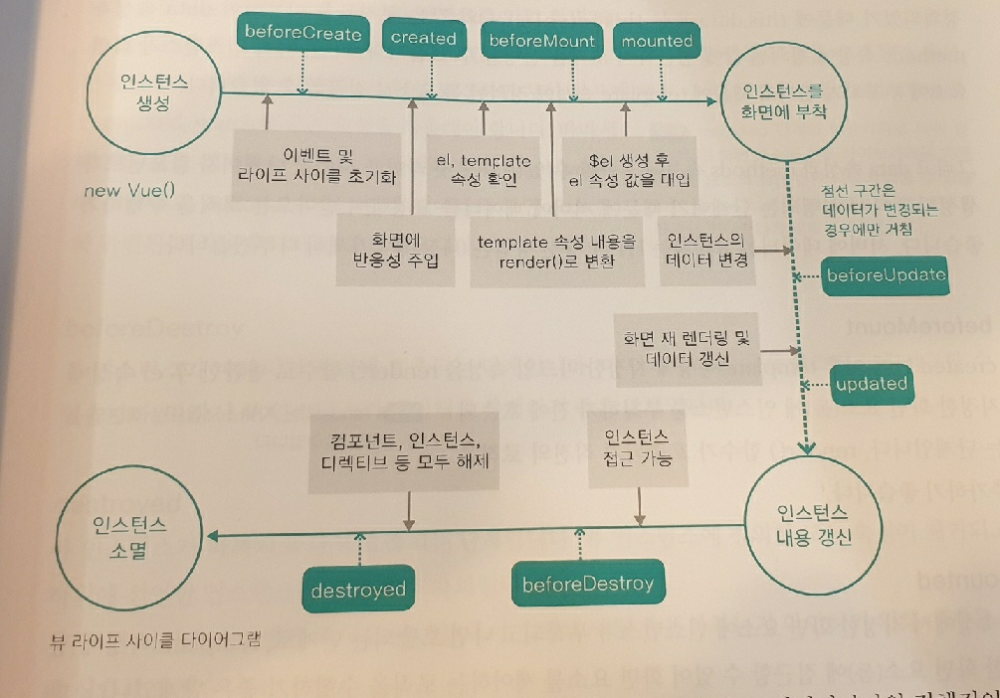

# doit-vuejs

## License & Copyright

**Copyright © 2017 Captain Pangyo**
<br><a rel="license" href="http://creativecommons.org/licenses/by-nc-nd/4.0/"></a><br>
This work is licensed under a <a rel="license" href="http://creativecommons.org/licenses/by-nc-nd/4.0/">Creative Commons Attribution-NonCommercial-NoDerivs 4.0 Unported License</a>.


# 1. Vue.js 소개

## 1-1. Vue.js란 무엇인가?

* Vue.js란?
  * 웹 페이지 화면을 개발하기 위한 프런트엔드 프레임워크


## 1-2. Vue.js의 특징

* UI 화면단 라이브러리
  * Vue는 MVVM 패턴의 뷰 모델(ViewModel)에 해당하는 화면단 라이브러리
  * MVVM패턴: 모델(Model) - 뷰(View) - 뷰 모델(ViewModel)로 구조화하여 개발하는 방식
  * 뷰(View): 사용자에게 보이는 화면
  * 돔(DOM): HTML 문서에 들어가는 요소(태그, 클래스, 속성 등)의 정보를 담고 있는 데이터 트리
  * 돔 리스너(DOM Listener): 돔의 변경 내역에 대해 즉각적으로 반응하여 특정 로직을 수행하는 장치
  * 모델(Model): 데이터를 담는 용기, 보통은 서버에서 가져온 데이터를 자바스크립트 객체 형태로 저장
  * 데이터 바인딩(Data Binding): 뷰(View)에 표시되는 내용과 모델의 데이터를 동기화
  * 뷰 모델(ViewModel): 뷰와 모델의 중간 영역. 돔 리스너와 데이터 바인딩을 제공하는 영역


# 2. 개발 환경 설정 및 첫 번째 프로젝트

## 2-2. Hello Vue.js! 프로젝트

```vue
<!DOCTYPE html>
<html lang="en">
<head>
    <meta charset="UTF-8">
    <meta name="viewport" content="width=device-width, initial-scale=1.0">
    <meta http-equiv="X-UA-Compatible" content="ie=edge">
    <title>Document</title>
</head>
<body>
    <div id='app'>
        {{ message }}
    </div>
    
    <script src="https://cdn.jsdelivr.net/npm/vue/dist/vue.js"></script>
    <script>
        new Vue({
            el: '#app',
            data: {
                message: 'Hello Vue.js!'
        });
    </script>
</body>
</html>
```


# 3. 인스턴스 & 컴포넌트

## 3-1. 뷰 인스턴스

* 뷰 인스턴스의 정의와 속성
  * 뷰 인스턴스(instance)는 뷰로 화면을 개발하기 위해 필수적으로 생성해야 하는 기본 단위

* 뷰 인스턴스 옵션 속성
  * template : 화면에 표시할 HTML, CSS 등의 마크업 요소를 정의하는 속성. 뷰의 데이터 및 기타 속성들도 함께 화면에 그릴 수 있으며 05장 뷰 템플릿에서 자세히 설명하도록 함
  * methods: 화면 로직 제어와 관계된 메서드를 정의하는 속성. 마우스 클릭 이벤트 처리와 같이 화면의 전반적인 이벤트와 화면 동작과 관련된 로직을 추가할 수 있음.
  * created: 뷰 인스턴스가 생성되지마자 실행할 로직을 정의할 수 있는 속성. 뷰 인스턴스 라이프 사이클 부분에서 추가로 설명


* 뷰 인스턴스 라이프 사이클

  

  * 라이프 사이클: 모바일 앱을 비롯하여 일반적으로 애플리케이션이 가지는 생명 주기
  * 라이프 사이클 속성: 인스턴스의 상태에 따라 호출할 수 있는 속성들
  * beforeCreate: data, methods 속성이 아직 인스턴스에 정의되어 있지 않고, 돔과 같은 화면 요소에도 접근할 수 없음
  * created: data, methods 속성이 정의되고 값에 접근하여 로직을 실행할 수  있음. 아직 인스턴스가 화면 요소에 부착되기 전이기 때문에 template 속성에 정의된 돔 요소로 접근할 수 없음.
  * beforeMount: 
  * mounted:
  * beforeUpdate:
  * updated:
  * beforeDestroy:
  * destroyed:


## 3-2. 뷰 컴포넌트

* 컴포넌트란?

  * 조합하여 화면을 구성할 수 있는 블록(화면의 특정 영역)
  * 컴포넌트 간의 관계는 자로구조의 트리(Tree) 모양과 유사

* 컴포넌트 등록

  * 지역 컴포넌트: 특정 인스턴스에서만 유효한 범위를 갖음

  * 전역 컴포넌트: 여러 인스턴스에서 공통으로 사용할 수 있음

  * 전역 컴포넌트 등록

    ```vue
    <html>
      <head>
        <title>Vue Component Registration</title>
      </head>
      <body>
        <div id="app">
          <button>컴포넌트 등록</button>
    			<my-component></my-component>
        </div>
    
        <script src="https://cdn.jsdelivr.net/npm/vue@2.5.2/dist/vue.js"></script>
        <script>
          Vue.component('my-component', {
            template: '<div>전역 컴포넌트가 등록되었습니다!</div>'
          });
    
          new Vue({
            el: '#app'
          });
        </script>
      </body>
    </html>
    
    ```

  * 지역 컴포넌트 등록

    ```vue
    <html>
      <head>
        <title>Vue Component Registration</title>
      </head>
      <body>
        <div id="app">
          <button>컴포넌트 등록</button>
          <my-local-component></my-local-component>
        </div>
    
        <script src="https://cdn.jsdelivr.net/npm/vue@2.5.2/dist/vue.js"></script>
        <script>
          var cmp = {
            // 컴포넌트 내용
            template: '<div>지역 컴포넌트가 등록되었습니다!</div>'
          };
    
          new Vue({
            el: '#app',
            components: {
              'my-local-component': cmp
            }
          });
        </script>
      </body>
    </html>
    
    ```

    

* 전역 & 지역 차이

  ```vue
  <html>
    <head>
      <title>Vue Local and Global Components</title>
    </head>
    <body>
      <div id="app">
        <h3>첫 번째 인스턴스 영역</h3>
        <my-global-component></my-global-component>
        <my-local-component></my-local-component>
      </div>
      <hr>
      <div id="app2">
        <h3>두 번째 인스턴스 영역</h3>
        <my-global-component></my-global-component>
        <my-local-component></my-local-component>
      </div>
  
      <script src="https://cdn.jsdelivr.net/npm/vue@2.5.2/dist/vue.js"></script>
      <script>
        // 전역 컴포넌트 등록
        Vue.component('my-global-component', {
          template: '<div>전역 컴포넌트 입니다.</div>'
        });
  
        // 지역 컴포넌트 내용
        var cmp = {
          template: '<div>지역 컴포넌트 입니다.</div>'
        };
  
        new Vue({
          el: '#app',
          // 지역 컴포넌트 등록
          components: {
            'my-local-component': cmp
          }
        });
  
        // 두 번째 인스턴스
        new Vue({
          el: '#app2'
        });
      </script>
    </body>
  </html>
  
  ```

  * app2에서는 app1에서 정의한 지역 컴포넌트(cmp)가 보이지 않음


