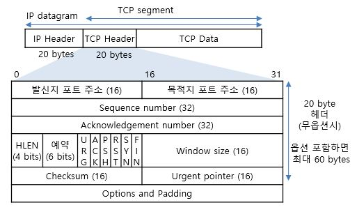
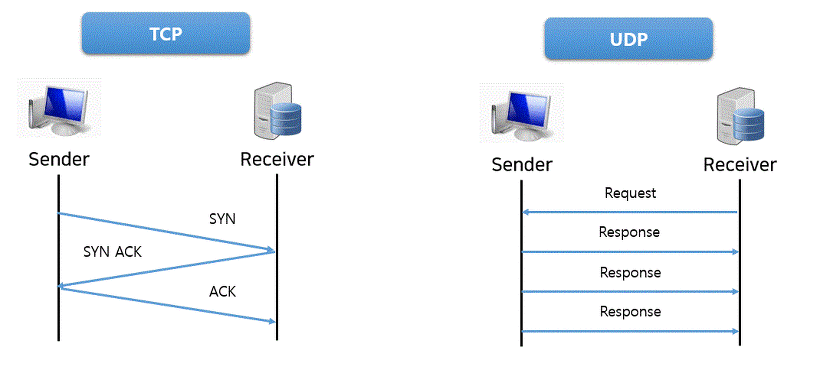

# CS 지식

## 라이브러리 vs 패키지

* 라이브러리 => 회사
* 패키지 => 홍보부, 영업부, R&D

## REST API

> REST 아키텍처의 제약 조건을 준수하는 애플리케이션 프로그래밍 인터페이스

* REpresentaional State Transfer(표현 상태 전달)
* RESTful?
  * REST란 아키텍쳐 스타일의 제약조건을 모두 만족하는 시스템

* API(Application Programming Interface)
  * 데이터와 기능의 집합을 제공하여 컴퓨터 프로그램간 상호작용을 촉진하며, 서로 정보를 교환가능 하도록 하는 것
* REST API의 정의
  * REST 기반으로 서비스 API를 구현한 것
  * 최근 OpenAPI(누구나 사용할 수 있도록 공개된 API: 구글 맵, 공공 데이터 등), 마이크로 서비스(하나의 큰 애플리케이션을 여러 개의 작은 애플리케이션으로 쪼개어 변경과 조합이 가능하도록 만든 아키텍처) 등을 제공하는 업체 대부분은 REST API를 제공한다.
* HTTP URI(Uniform Resource Identifier)를 통해 자원(Resource)을 명시하고, HTTP Method(POST, GET, PUT, DELETE)를 통해 해당 자원에 대한 CRUD Operation을 적용
* HTTP 요청을 보낼 때 어떤 URI에 어떤 메소드를 사용할지 개발자들 사이에 약속된 규칙

[참고링크](https://gmlwjd9405.github.io/2018/09/21/rest-and-restful.html)

## MVC 패턴

>  디자인 패턴 중 하나로 Model, View, Controller로 나누어 개발하는 방식
>
> 맡은 바에만 집중할 수 있어서 효율적인 개발을 가능케 함

* 디자인 패턴

  프로그램이나 어떤 특정한 것을 개발하는 중에 발생했던 문제점들을 정리해서 상황에 따라 간편하게 적용해서 쓸 수 있는 것을 정리하여 특정한 "규약"을 통해 쉽게 쓸 수 있는 형태로 만든 것

* Model: DB에 저장할 데이터를 정의하는 부분
* View: 화면에 보여지는 부분
* Controller: Model과 View 사이에서 조작을 하는 부분

* Django 에서는 MVT 패턴으로 불림
  * Model: 동일
  * View: MVC 패턴의 Controller와 같은 역할
  * Template: MVC 패턴의 View와 같은 역할

## 애자일(Agile)

> 소프트웨어 개발  방법론 중 하나로 처음부터 끝까지 계획을 수립하고 개발하는 폭포수(Waterfall) 방법론과는 달리 개발과 함께 즉시 피드백을 받아서 유동적으로 개발하는 방법

* 애자일 개발 프로세스 개발 방법론
  * 익스트림 프로그래밍(Extreme Programming)
  * 스크럼(Scrum)

## 객체지향 프로그래밍(OOP)

> 컴퓨터 프로그래밍 패러다임 중 하나
>
> [컴퓨터 프로그램](https://ko.wikipedia.org/wiki/컴퓨터_프로그램)을 [명령어](https://ko.wikipedia.org/wiki/명령어_(컴퓨팅))의 목록으로 보는 시각에서 벗어나 여러 개의 독립된 단위, 즉 "[객체](https://ko.wikipedia.org/wiki/객체_(컴퓨터_과학))"들의 모임으로 파악하고자 하는 것

* 클래스와 인스턴스

  * 클래스

    어떤 문제를 해결하기 위한 데이터를 만들기 위해 추상화를 거쳐 집단에 속하는 속성(attribute)와 행위(behavior)를 변수와 메서드로 정의한 것

  * 인스턴스(객체)

    클래스에서 정의한 것을 토대로 실제 메모리상에 할당된 것으로 실제 프로그람에서 사용되는 데이터

* 비유

  * 붕어빵 틀 => 클래스
  * 붕어빵 => 객체

* 속성

  * 은닉성(캡슐화)

    기능과 특성의 모음을 "클래스"라는 "캡슐"에 분류해서 넣는것

    관련된 기능과 특성을 한 곳에 모으고 분류하기 때문에 재활용이 원활

    

  * 상속

    부모클래스의 속성과 기능을 그대로 이어받아 사용할 수 있게하고 기능의 일부분을 변경해야 할 경우 상속받은 자식클래스에서 해당 기능만 다시 수정(정의)하여 사용할 수 있게 하는 것

    

  * 다형성

    하나의 변수명, 함수명 등이 상황에 따라 다른 의미로 해석될 수 있는 것, 즉 오버라이딩, 오버로딩이 가능하다는 뜻

    * 오버라이딩: 부모클래스의 메서드와 같은 이름, 매개변수를 재정의 하는것
    * 오버로딩: 같은 이름의 함수를 여러개 정의하고, 매개변수의 타입과 개수를 다르게 하여 매개변수에 따라 다르게 호출할 수 있게 하는 것

  * 추상 클래스

    상속을 받아서 기능을 확장시키는 것(부모의 유전자를 물려받음)

    다중 상속은 충돌의 우려가 있기 때문에 불가

  * 인터페이스

    구현하는 모든 클래스에 대해 특정한 메서드가 반드시 존재하도록 강제하는 역할(부모로부터 유전자를 물려받는 것이 아니라 사교적으로 필요에 따라 결합하는 관계)

    자바에서는 선언할 때 public static final이 생략된 상태로 선언

    추상 클래스와는 다르게 다중 상속이 가능

    클래스가 상속을 받을 때는 extends가 아닌 implements

* 장점

  * 코드 재사용 용이

    남이 만든 클래스를 가져와서 이용할 수 있고 상속을 통해 확장해서 사용할 수 있음

  * 유지보수가 쉬움

    절차 지향 프로그래밍에서는 코드를 수정해야할 때 일일이 찾아 수정해야하는 반면 객체 지향 프로그래밍에서는 수정해야 할 부분이 클래스 내부에 멤버 변수 혹은 메서드로 있기 때문에 해당 부분만 수정하면 됨

  * 대형 프로젝트에 적합

    클래스 단위로 모듈화시켜서 개발할 수 있으므로 대형 프로젝트처럼 여러명, 여러 회사에서 개발이 필요할 시 업무 분담하기 쉬움

* 단점

  * 처리속도가 상대적으로 느림
  * 객체가 많으면 용량이 커질 수 있음
  * 설계시 많은 시간과 노력이 필요

[참고링크](https://jeong-pro.tistory.com/95)

## 추상클래스/인터페이스

* 추상클래스 => 물려받는 것(상속), ex) 박쥐/날다람쥐 => 포유류 라는 특성은 부모에게 물려받는 것
* 인터페이스 => 장착하는 것, ex) 날다, 자격증

## 프로세스/쓰레드

* 프로세스

  운영체제로부터 자원을 할당받은 작업의 단위

  운영체제는 안전성을 위해서 프로세스마다 할당된 메모리 내의 정보만 접근할 수 있도록 제약을 둠

  운영체제로부터 Code/Data/Stack/Heap 메모리 영역을 할당받음

* 쓰레드

  프로세스가 할당받은 자원을 이용하는 실행 흐름의 단위

  프로세스와 다르게 쓰레드간 메모리를 공유하며 작동

  프로세스 내에서 Stack 메모리 영역을 제외한 다른 메모리 영역을 같은 프로세스 내 다른 쓰레드와 공유

* 프로그램

  파일이 저장 장치에 저장되어 있지만 메모리에는 올라가 있지 않은 정적인 상태

  * 메모리가 올라가 있지 않은: 운영체제가 독립적인 메모리 공간을 할당하지 않은 상태
  * 정적인 상태: 아직 실행되지 않고 가만히 있다는 뜻

[참고](https://velog.io/@raejoonee/%ED%94%84%EB%A1%9C%EC%84%B8%EC%8A%A4%EC%99%80-%EC%8A%A4%EB%A0%88%EB%93%9C%EC%9D%98-%EC%B0%A8%EC%9D%B4)

## Spring vs Django

[참고](https://seolin.tistory.com/119)

## ORM 장단점

* 장점
  - 반복적인 SQL 코드가 필요하지 않아서 신속한 개발이 가능
  - 개발 비용을 절감
  - 업체별 SQL 차이점을 극복한다. ORM은 업체별 SQL을 작성하는 방법을 알고 있으므로 필요하지 않음
  - ORM으로 프로그래밍하는 것을 배우는 동안 개발자 생산성 저하되지만 장기적으로는 개발 시간을 단축
  - 객체 지향적인 코드로 인해 더 직관적이고 비즈니스 로직에 더 집중
* 단점
  * 모든것을 ORM으로만 구현하기 어려움
  * 프로젝트의 복잡성이 크면 구현하는 난이도가 상승
  * 잘못 구현한 경우 성능이 저하
  * 프로시저가 많은 곳은 ORM의 장점을 활용하기 어려움

[참고](https://lalwr.blogspot.com/2019/09/orm.html)

## AWS

## NoSQL

> Not Only SQL의 약자로, SQL만을 사용하지 않는 데이터베이스 관리 시스팀(DBMS)을 지칭하는 단어

* 관계형 데이터베이스를 사용하지 않는다는 의미가 아닌, 여러 유형의 데이터베이스를 사용하는 것
* 특징
  * 관계형 모델을 사용하지 않으면 테이블 간의 조인 기능 없음
  * 직접 프로그래밍을 하는 등의 비SQL 인터페이스를 통한 데이터 액세스
  * 대부분 여러 대의 데이터베이스 서버를 묶어서(클러스터링) 하나의 데이터베이스를 구성
  * 관계형 데이터베이스에서 지원하는 Data 처리 완결성(Transaction ACID 지원) 미보장
  * 데이터의 스키마와 속성들을 다양하게 수용 및 동적 정의(Schema-less)
  * 데이터베이스의 중단 없는 서비스와 자동 복구 기능 지원
  * 다수가 Open Source로 제공
  * 확장성, 가용성, 높은 성능
* 종류
  * Key Value DB
  * Wide Columnar Store
  * Document DB
  * Graph DB

## 서버리스

## Mutable vs Immutable 자료형(자바 기준)

## OSI 7계층

> "응표"가 "세트"장에서 일하는데 "네 데"신  "물" 먹었다
>
> 물리부터 응용까지 차례대로 1~7단계

[출처](https://madplay.github.io/post/network-osi-7-layer)

* 응용 계층(Application Layer)
  * 사용자(응용 프로그램)가 OSI 환경에 접근할 수 있도록 서비스를 제공
* 표현 계층(Presentation Layer)
  * 응용 계층으로부터 받은 데이터를 세션 계층에 맞게, 세션 계층에서 받은 데이터는 응용 계층에 맞게 변환하는 기능
  * 코드 변환, 데이터 암호화, 데이터 압축, 구문 검색, 정보 형식(포맷) 변환 기능
* 세션 계층(Session Layer)
  * 송수신측 간의 관련성을 유지하고 대화 제어를 담당
  * 대화(회화) 구성 및 동기 제어, 데이터 교환 관리 기능
* 전송 계층(Transport Layer)
  * 종단 시스템(End-to-End) 간의 신뢰성 있고 투명한 데이터 전송을 가능하게 함
  * 포트 번호를 사용하여 도착지 컴퓨터의 최종  도착지인 프로세스에까지 데이터가 도달하게 하는 모듈
  * 운영체제의 커널에 소프트웨어적으로 구현되어 있음
  * 전송 연결 설정, 데이터 전송, 연결 해제 기능
  * 관련 장비: 게이트웨이
* 네트워크 계층(Network Layer, 망계층)
  * 개방 시스템들 간의 네트워크 연결 관리(네트워크 연결을 설정, 유지, 해제), 데이터 교환 및 중계
  * 경로 설정(Routing), 트래픽 제어, 패킷 정보 전송
  * 자신 다음의 라우터에게 데이터를 넘겨주는 것(forwarding)
  * 운영체제의 커널에 소프트웨어적으로 구현되어 있음
  * 관련 장비: 라우터
* 데이터 링크 계층(Data Link Layer)
  * 두 개의 인접한 개방 시스템들 간에 신뢰성 있고 효율적인 정보 전송을 할 수 있도록 함
  * 패킷 앞뒤에 0000, 1111과 같은 번호를 붙여서 구분할 수 있게 함
  * 흐름 제어, 프레임 동기화, 오류 제어, 순서 제어 기능
  * 관련 장비: 랜카드, 브리지, 스위치
* 물리 계층(Physical Layer)
  * 전송에 필요한 두 장치 간의 실제 접속과 절단 등 기계적, 전기적, 기능적, 절차적 특성을 정의한다.
  * 0/1로 이루어진 디지털 신호를 주파 수를 가진 아날로그 신호로 바꾸어서 통신을 가능하게 함
  * 관련 장비: 리피터, 허브

## DNS

## 라우팅

## TCP/IP 모델

* 현대의 인터넷은 OSI 모델이 아니라 TCP/IP 모델을 따름
* 업데이트 이전 TCP/IP 모델은 1,2계층도 합쳐져 있었으나 업데이트 되면서  1,2계층이 나눠져 OSI 7계층과 같아짐
* OSI 7계층에서 5,6,7계층이 Application Layer로 합쳐짐

## TCP/UDP

### Transport Layer

* 신뢰성: 데이터를 순차적, 안정적인 전달
* 전송: 포트 번호에 해당하는 프로세스에 데이터를 전달

### TCP(Transmission Control Protocol)

* 신뢰성 있는 데이터 통신을 가능하게 해주는 프로토콜
* 특징: Connection 연결(3 way handshake) - 양방향 통신
* 데이터의 순차 전송을 보장
* Flow Control (흐름 제어)
* Congestion Control (혼잡 제어)
* Error Detection (오류 감지)

* 세그먼트(Segement) - TCP 프로토콜의 PDU(Protocol Data Unit, 프로토콜 데이터 단위)
  * 전송하고자 하는 데이터를 잘라서 TCP Header와 결합되어 만들어지는 단위
  * **프로토콜 데이터 단위**(Protocol Data Unit)는 데이터 통신에서 상위 [계층](https://ko.wikipedia.org/wiki/OSI_모형)이 전달한 데이터에 붙이는 제어정보를 뜻함
* 전송의 신뢰성은 보장하지만 매번 Connection을 연결해서 시간 손실 발생(3 way-handshake)
* 패킷을 조금만 손실해서 재전송

#### 3-way handshake (Connection 연결)

* SYN 비트를 1로 설정해 패킷 송신
* SYN, ACK 비트를 1로 설정해 패킷 송신
* ACK 비트를 1로 설정해 패킷 송신
* 만약 ACK를 수신하지 못하면 재전송

#### 4-way handshake (Connection close 할때)

* 데이터를 전부 송신한 Client가 FIN 송신
* Server가 ACK 송신
* Server에서 남은 패킷 송신 (일정 시간 대기)
* Server가 FIN 송신
* Client가 ACK 송신

### UDP(User Datagram Protocol)

* TCP보다 신뢰성이 떨어지지만 전송 속도가 일반적으로 빠른 프로토콜(순차 전송X, 흐름 제어X, 혼잡 제어X)
* Connectionless (3 way-handshake X)
* Error Detection
* 비교적 데이터의 신뢰성이 중요하지 않을 때 사용(ex. 영상 스트리밍)
* User Datagram - UDP 프로토콜의 PDU

## 클라이언트/서버 패러다임

## AOP

## 자바에서 new 객체 vs 바로 대입

[참고링크](https://ict-nroo.tistory.com/18)

## 파이썬에서의 메모리 관리

[참고링크](https://dc7303.github.io/python/2019/08/06/python-memory/)

## 클라우드 서비스 종류

* IaaS(Infrastructure as a Service)
  * 인프라로서의 서비스를 뜻하며 기존에 물리적인 형태로 사용해왔던 스토리지 서버 등의 인프라를 가상화된 환경에서 쉽고 신속하게 할당받아 사용할 수 있는 서비스. 아래에서 설명할 PaaS와 SaaS의 기반이 되는 가장 기본적인 클라우드 서비스의 형태
  * ex) 아마존의 AWS 서비스 중 EC2, S3, 가비아의 g클라우드
* PaaS(Platform as a Service)
  * IaaS 서비스로 제공되는 인프라 위에 사용자가 원하는 서비스를 개발할 수 있는 환경(Platform)을 제공하는 서비스
  * 기존의 물리 서버 환경에서는 새로운 서비스를 개발하기 위해서 서버를 구매하고 IDC 센터에 입주한 후 서버에 OS, 미들웨어 등을 설치해야 하는 등 개발에 들어가기까지 필요한 선행작업으로 소비되는 시간과 비용이 많았음. 또한, 이런 물리적인 환경은 지속적인 관리가 필요
  * 하지만 PaaS를 이용한다면 서비스 외적인 부분에 시간과 비용을 들이지 않고 서비스 개발에 집중할 수 있으므로 기존 물리환경에서 서비스를 개발할 때보다 비교적 적은 비용으로 신속하고 간편하게 서비스를 개발하고 운영할 수 있음
  * ex) 구글의 앱 엔진
* SaaS(Software as a Service)
  * 클라우드 기반의 응용 프로그램을 서비스 형태로 제공하는 것을 말하며, 일반 사용자들이 가장 많이 접하게 되는 형태
  * ex) 웹 기반 개인용 스토리지 서비스(드롭박스, N드라이브), 구글 드라이브, One드라이브

[출처](https://library.gabia.com/contents/infrahosting/2257/)