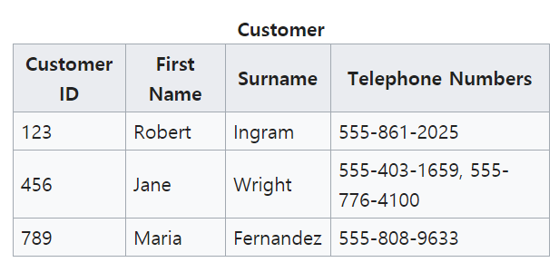
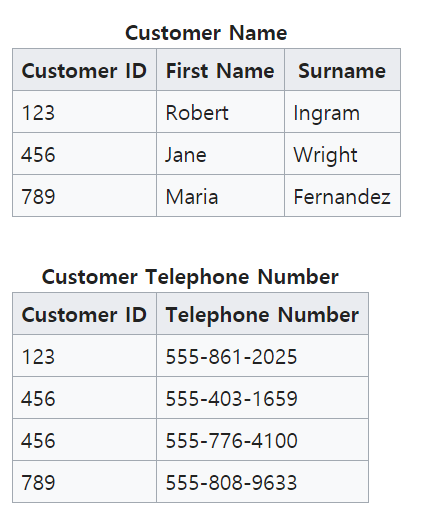
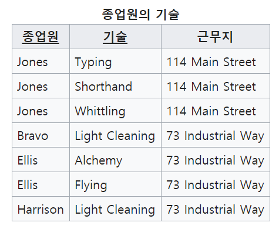
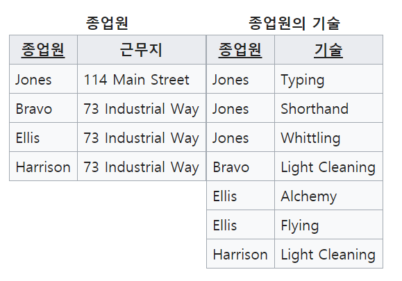
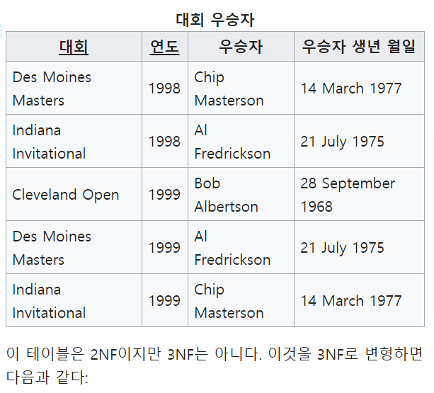
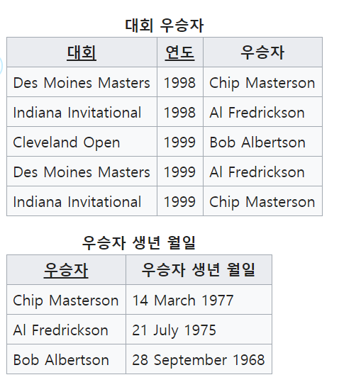

# 데이터베이스 정규화

[위키백과]([https://ko.wikipedia.org/wiki/%EB%8D%B0%EC%9D%B4%ED%84%B0%EB%B2%A0%EC%9D%B4%EC%8A%A4_%EC%A0%95%EA%B7%9C%ED%99%94](https://ko.wikipedia.org/wiki/데이터베이스_정규화))

[참조 블로그](https://wkdtjsgur100.github.io/database-normalization/)

## 정규화

* 관계형 데이터베이스의 설계에서 중복을 최소화하게 데이터를 구조화하는 프로세스
* 이상이 있는 관계를 재구성하여 작고 잘 조직된 관계를 생성하는 것이 목표
* 크고, 제대로 조직되지 않은 테이블들과 관계들을 작고 잘 조직된 테이블과 관계들로 나누는 것을 포함

## 제1정규형(1NF)

[위키백과]([https://ko.wikipedia.org/wiki/%EC%A0%9C1%EC%A0%95%EA%B7%9C%ED%98%95#1NF%EB%A5%BC_%EC%B6%A9%EC%A1%B1%ED%95%98%EB%8A%94_%EB%94%94%EC%9E%90%EC%9D%B8](https://ko.wikipedia.org/wiki/제1정규형#1NF를_충족하는_디자인))

* 관계형 데이터베이스의 테이블이 1NF이면 최소한 테이블은 관계이며, 중복되는 항목이 없어야 한다.

* **관계**는 동일한 구조로 이루어진 튜플의 집합

* 다음 표준들을 요구

  * 각 테이블에서 중복을 제거한다
  * 각각 관계된 데이터 모임을 위하여 분리된 테이블을 만든다.
  * 각각 관계된 데이터 모임을 기본키로 식별

* 변경전

  

* 변경후

  

  

## 제2정규형(2NF)

[위키백과]([https://ko.wikipedia.org/wiki/%EC%A0%9C2%EC%A0%95%EA%B7%9C%ED%98%95](https://ko.wikipedia.org/wiki/제2정규형))

* 후보 키 K와 K에 속하지 않는 속성 A가 있을 때, A를 결정하기 위해 일부가 아닌 K 전체를 참조해야만 하는 경우 1NF 테이블은 2NF

* 모든 비기본 속성들이 후보키에 속한 속성들 전체에 함수 종속인 경우에 한해서 1NF 테이블은 2NF

* 1NF 테이블은 복합 후보 키(한 개 이상의 속성들로 구성된 후보 키)가 없으면 자동으로 2NF

* 부분 함수 종속이 없고, 모두 완전 함수 종속

* **후보키(candidate key)**는 관계형 데이터베이스의 관계형 모델에서 슈퍼 키 중 더 이상 줄일 수 없는 형태를 가진 것

* **슈퍼키(super key)**는 데이터베이스에서 관계(테이블)의 행을 고유하게 식별할 수 있는 속성 또는 속성의 집합. 슈퍼 키는 대상관계의 모든 속성이 함수 종속하는 속성의 집합으로 정의

* 변경전

  

* 변경후

  

## 제3정규형

[위키백과]([https://ko.wikipedia.org/wiki/%EC%A0%9C3%EC%A0%95%EA%B7%9C%ED%98%95](https://ko.wikipedia.org/wiki/제3정규형))

* 테이블이 제2정규형을 만족하고, 테이블 내의 모든 속성이 기본 키에만 의존하며, 다른 후보 키에 의존하지 않음

* 추이 종속이 존재하지 않음을 요구

* 변경 전

  

* 변경 후

  