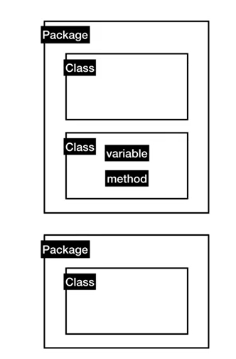

# [생활코딩 JAVA1 강의 정리](https://opentutorials.org/course/3930)

## Java의 동작원리

1. `.java`라는 확장자의 파일에 자바소스코드를 만든다
2. 이 소스코드를 컴퓨터는 읽지 못하니, Compile을 거친다.
3. Compile을 거치고 .Class 확장자의 파일로 된다
4. java virtual machine이 class 확장자를 run해서 읽어온다.


## 연산과 문자열

### 연산

* `sout`하고 `ctrl + space`하면 출력 자동 완성
* `6 + '6'` 하면 `66`이 됨
* `Math`를 활용하면 다양한 수학 함수를 활용할 수 있음
* `Math.floor`: 내림, `Math.ceil` 올림

### 문자열

* 작은 따옴표는 문자(한글자) : Character
* 큰 따옴표가 문자열 : String


## Iot 프로젝트

* `Ctrl + Space` : 자동완성
* import 로 원하는 라이브러리 불러올 수 있음


## 디버그

* 디버그 : 버그를 잡는 행위
* 코드 왼쪽에서 더블 클릭을 해서 중단하고자 하는 지점을 설정

* `Step Over`: 코드에서 줄 단위로 넘어가면서 진행상황을 보여줌
* `Step Into`: 코드에 제시된 메소드의 내부구조까지 탐색하면서 진행상황을 보여줌


## 입력과 출력

* `args` : 매개변수, 파라미터

  ```java
  public static void(String[] args)
  ```


## Java 문서 보는법

> API 사용 방법을 알아보기

### API vs UI

* `System`, `Date`, `Math` => 기본 라이브러리
* 라이브러리를 이용하여 프로그램을 만듦
* `Application Programming Interface(API)` => Java의 라이브러리를 응용해서 프로그램을 만들기 위해서 조작해야하는 장치들
* 이렇게 만들어진 장치가 사람을 위해 사용된다면 `User Interface(UI)`


### 패키지, 클래스, 변수, 메소드

* `java.lang` => `Math` 클래스가 속해있는 패키지

* `java.lang` 패키지 속에는 `Math`, `String` 같은 연관된 클래스가 있음

* `패키지` => `클래스`를 그룹핑해서 모아놓은 것

* `클래스` => 서로 연관된 변수와 메소드로 그룹핑

  


### 인스턴스

* `생성자(constructor)`가 없으면 1회용 ex) System.out.println(), Math.PI()
* 훨씬 경제적으로 프로그래밍 할 수 있음


### 상속

* `open hierarchy`를 통해 상속 관계를 볼 수 있음
* `override` => 자식 메소드가 부모 메소드의 기능을 덮어씀

## 직접 컴파일하고 실행하기

* `cmd`에서 `javac`명령어를 통해 사용법을 알 수 있음

* `javac`는 `C:\Program Files\Java\jdk-13.0.2\bin` 경로에 있는 `javac.exe`를 읽어오는 것

* `path` 환경변수를 통해 경로확인

* `cd`: change directory의 약자, 이동하는 기능

* `ls`: 디렉토리내의 파일을 보여줌

* `dir`: 윈도우에서 파일 확인

  


## 나의 앱 만들기

### 메소드

* 메소드 생성을 통해 코드를 더 깔끔하게 구성할 수 있음
* 메소드를 만들때 local 변수는 사용할 수 없으므로 `public class 클래스명`과 `public static main void(String args[])` 사이에 `public static 변수자료형 변수명` 형태로 변수를 선언

### 클래스

* 상단 메뉴에서 `Window - Show View - Outline`을 설정하여 띄움
* `Outline`는 클래스 소속의 멤버(변수, 클래스)를 보여줌


### 인스턴스

* 서로 다른 데이터 값과 서로 같은 메소드를 가진 복제본을 만드는 것
* 인스턴스를 사용하기 위해서는 사용될 변수와 클래스에 `static`이 붙어있으면 안됨


## method

* `public`,  `private`, `protected`, `default`
* `public`: 클래스 어디에서나 사용 가능
* `private`: 같은 클래스 안에서만 사용 가능


## static

* `static`: class method, 클래스 변수일때 사용
* `no static`: instance method, 인스턴스 변수일때 사용
* `void`는 리턴 값이 없다는 의미